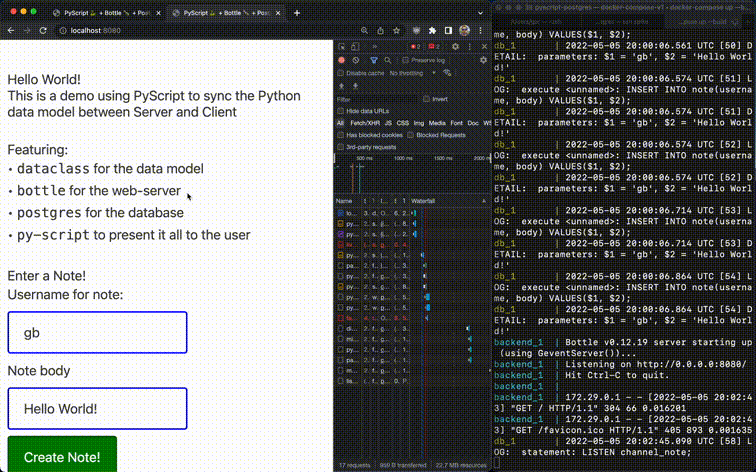
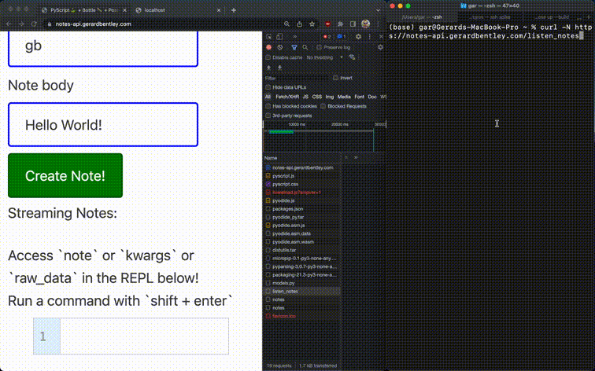
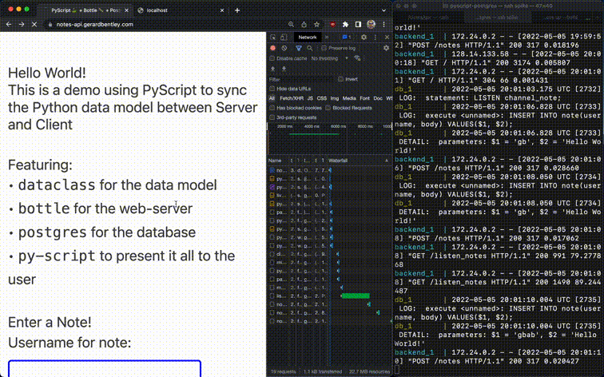

# Python Full Stack

Exploring [PyScript](https://pyscript.net/) connecting to a [Postgres](https://www.postgresql.org/) database via a [Bottle](https://bottlepy.org/docs/dev/) + [gevent](http://www.gevent.org/) backend.

Using Python full stack for frontend data parsing and backend as a webservice.
Use your dataclasses / Pydantic models to validate and handle Python objects on the Client and Server!

Built with ❤️ from [Gar's Bar](https://tech.gerardbentley.com/)

Intended Demo (working locally and with curl):



PyScript Create + curl stream demo:



See bottom or visit [notes-api.gerardbentley.com](https://notes-api.gerardbentley.com) to inspect the browser broken stream.

## What's this?

- `README.md`: This Document! To help you find your way around
- `LICENSE`: Follows PyScript's use of Apache 2.0 Open Source License
- `index.html`: The webpage with the frontend code
- `models.py`: Contains the data model for use in PyScript and the Backend
- `docker-compose.yml`: Tells the `postgres` and `backend` containers how to run with `docker-compose up`
- `backend/`: A `bottle` webserver that streams new notes at `/listen_notes` and allows creating new notes at `/notes`
- `postgres/`: Scripts related to setting up the database for this project 
- `.gitignore`: Tells git to avoid comitting / scanning certain local-specific files

## Local Setup

Assumes a working docker installation and some command line knowledge.

Local database configuration is set by `.env.dev`

```sh
git clone git@github.com:gerardrbentley/pyscript-postgres.git
cd pyscript-postgres
mv example.env .env.dev
docker-compose up --build
```

Open `index.html` in a browser using something like VS Code [Live Preview](https://marketplace.visualstudio.com/items?itemName=ms-vscode.live-server) or `python -m http.server --directory . 8000` then open [http://localhost:8000](http://localhost:8000)

*Notes:*

- Use `--build` with docker-compose to rebuild image after changing dependencies / dockerfile.
- Use `-d` with docker-compose to detach from terminal output (remember to `docker-compose down` when you want it to stop)
- Use `docker-compose down --volumes` to wipe database (docker volume)

## Walkthrough

Stream real time notes to PyScript via Postgres notifications.

Note: this is adapted from flask and psycopg2 example in the book [Serious Python](https://nostarch.com/seriouspython).

Postgres has the ability to notify listeners when a row is inserted in a given table.
This is generally better than polling the database every X seconds looking for new information.

In this we'll go over how to stream those notifications via a Bottle API and how to receive and handle them on the frontend with PyScript and the Browser [Fetch API](https://developer.mozilla.org/en-US/docs/Web/API/Fetch_API/Using_Fetch)

### Database Setup

For setting up this Postgres database we'll need:

- A table for the notes
- A function that will notify listeners with json message data
- To trigger the function whenever a row is inserted in the table

We'll also add an auto updating timestamp column whenever a record changes in case this idea expands to a full CRUD usecase.

This is all handled in the Postgres initialization scripts in `/postgres`, which get called by the Docker image when running locally.

Some of the pieces:

    CREATE TABLE IF NOT EXISTS note (
        rowid serial NOT NULL PRIMARY KEY,
        created_timestamp timestamptz NOT NULL DEFAULT NOW(),
        updated_timestamp timestamptz NOT NULL DEFAULT NOW(),
        username varchar(140) NOT NULL,
        body varchar(140) NOT NULL
    );

    CREATE OR REPLACE FUNCTION notify_on_insert ()
        RETURNS TRIGGER
        AS $$
    BEGIN
        PERFORM
            pg_notify('channel_note', CAST(row_to_json(NEW) AS text));
        RETURN NULL;
    END;
    $$
    LANGUAGE plpgsql;

    CREATE TRIGGER notify_on_message_insert
        AFTER INSERT ON note
        FOR EACH ROW
        EXECUTE PROCEDURE notify_on_insert ();

#### Verify

You can inspect the Postgres database with `psql` via the following command (assuming no changes to `.env.dev`):

`docker-compose exec db psql dev_db dev_user`

Commands such as:

```psql
# Show all tables
\dt

# Describe note table
\d note

# Show all functions
\df

# Show the data in note
SELECT * FROM note;

# Quit psql
\q
```

#### Test Notification

```psql
LISTEN channel_note;

# LISTEN

INSERT INTO note(username, body) VALUES('gb', 'hello world');

# INSERT 0 1
# Asynchronous notification "channel_note" with payload "{"rowid":2,"created_timestamp":"2022-05-03T19:20:52.854098+00:00","updated_timestamp":"2022-05-03T19:20:52.854098+00:00","username":"gb","body":"hello world"}" received from server process with PID 41.
```

Sweet!

### Python Listening

The `listen.py` script will open a connection to the database and listen for notes

It requires [`psycopg` to be installed](https://www.psycopg.org/psycopg3/docs/basic/install.html) in your current Python environment, then you can run it like:

```sh
python listen.py
```

Then in a psql terminal enter a new message:

```psql
INSERT INTO note(username, body) VALUES('gb', 'hello there');
```

(*NOTE:* Use `docker-compose exec db psql dev_db dev_user` to launch psql terminal)

You should see a message in your python terminal similar to:

`Got NOTIFY: 45 channel_note {"rowid":5,"created_timestamp":"2022-05-03T19:24:26.493428+00:00","updated_timestamp":"2022-05-03T19:24:26.493428+00:00","username":"gb","body":"hello there"}`

Feel free to open more psql and python terminals to test out multiple connections.

#### Compare to psycopg2

The example from the text uses functions that were removed in psycopg between version 2 and 3.

This chunk of code:

```py
while True:
    conn.poll()
    while conn.notifies:
        notify = conn.notifies.pop()
```

Becomes:

```py
gen = connection.notifies()
while (notify := next(gen)):
    ...
```

The `notifies()` function in psycopg3 returns a generator.
To infinitely listen to that generator we can use a while statement and the walrus operator ([PEP-572](https://www.python.org/dev/peps/pep-0572/)) to assign the `next` value from the generator and see if it is Truthy.

### Python Backend

A browser client can't connect to Postgres over TCP/IP, and it's generally an insecure idea to expose your Database to the public, so let's make a backend to serve this stream of data notifications.

Using `bottle` + `gevent` we can make a basic streaming service.

Now opening a browser to [http://localhost:8080/listen_notes](http://localhost:8080/listen_notes) or using `curl -N -v http://localhost:8080/listen_notes` should let you see notifications from postgres come through to your HTTP client!

(`-N` for no buffering and `-v` to see more details)

You may need to create a record for anything to happen with `psql` or another `curl` command:

```sh
curl -v -d '{"username": "gb", "body": "Hello World!"}' "http://localhost:8080/notes"
```

For simplicity we just include the psycopg connection and cursor the same way as in `listen.py` in the route handler function.
Also note at the top that the first line should always be importing `gevent` and using `monkey.patch_all()`:

```py
from gevent import monkey
monkey.patch_all()

import os
import select

from bottle import route, run, request, response, default_app
import gevent
import psycopg


@route("/listen_notes")
def listen_notes():
    # Connect to postgres
    ...
    while notify := next(gen):
        yield notify.payload


if __name__ == "__main__":
    app = default_app()
    app.add_hook("after_request", apply_cors)
    run(
        app,
        host="0.0.0.0",
        port=os.getenv("PORT", 8080),
        server="gevent",
        reloader=True,
    )
```

*NOTE:* CORS is a tricky topic for beginners, but important to understand the basics of when making web requests from a Client's browser.
In this case we need to allow all origins in order for PyScript to not error out.
We can also add a route that allows the OPTIONS header:

```py
@route("/<:re:.*>", method="OPTIONS")
def cors():
    pass

def apply_cors():
    response.headers["Access-Control-Allow-Origin"] = "*"
    response.headers["Access-Control-Allow-Methods"] = "GET, POST, DELETE, PUT, OPTIONS"
    response.headers[
        "Access-Control-Allow-Headers"
    ] = "Origin, Accept, Content-Type, X-Requested-With, X-CSRF-Token, Authorization"
```

### Python Frontend

So far we just used Python as a way to stream Postgres notifications over HTTP.

In most applications the backend will perform some transformations to make the data more usable / presentable for the frontend.

In this specific case one transformation might be to go from a Postgres datetime string to an epoch timestamp.

#### Dataclass Data Model

In `models.py` we have some Python code using the built-in `dataclass` that can handle this task:

```py
from dataclasses import dataclass
from datetime import datetime

def timestamp_from_iso(raw_datetime: str) -> int:
    return int(datetime.strptime(raw_datetime, '%Y-%m-%dT%H:%M:%S.%f%z').timestamp())

@dataclass
class Note:
    rowid: int
    created_timestamp: int
    updated_timestamp: int
    username: str
    body: str

    def __post_init__(self):
        if isinstance(self.created_timestamp, str):
            self.created_timestamp = timestamp_from_iso(self.created_timestamp)
        if isinstance(self.updated_timestamp, str):
            self.updated_timestamp = timestamp_from_iso(self.updated_timestamp)
```

*NOTE:* for more advanced data validation / parsing / type-coercion look into [`pydantic`](https://pydantic-docs.helpmanual.io/) and [`attrs`](https://www.attrs.org/en/stable/)

*ASIDE:* Using `strptime` because `fromisoformat` broke on some Postgres timestamps:

```sh
>>> from datetime import datetime
>>> datetime.fromisoformat('2022-05-03T20:11:07.93299+00:00')
Traceback (most recent call last):
  File "<stdin>", line 1, in <module>
ValueError: Invalid isoformat string: '2022-05-03T20:11:07.93299+00:00'
```

#### Traditional Way

Traditionally a Python developer would have to run this code on the backend server.
We could add a few lines after getting the Postgres notification to convert the timestamps and then re-convert to a string for sending over HTTP:

```py
@route("/listen_notes")
def listen_notes():
    # Connect to postgres
    ...
    while notify := next(gen):
        raw_data = json.loads(notify.payload)
        note = Note(**raw_data)
        yield json.dumps(asdict(note))
```

#### PyScript Way

But let's get untraditional!

PyScript / Pyodide won't let us make web requests in the browser sandbox, so we'll lean on the Javascript Fetch API to do that.
But we'll lean on PyScript to do the data parsing / coercion from raw postgres notification and passing that back to Javascript to display in the DOM!

#### Listen for Notes

Setting up the listener involves using the `fetch` API and the `getReader()` method on the fetch response body.

We can loop over this reader until there isn't a response from the server:

```py
import asyncio
from js import fetch

async def listen():
    response = await fetch("http://localhost:8080/listen_notes")
    reader = response.body.getReader()
    while True:
        try:
            read_val = await reader.read()
            yield read_val
        except TypeError as e:
            break
```

And since we turned this listener function into an async generator, we have some nice syntax in Python to process each thing that comes from the reader:

```py
import json
from dataclasses import asdict

from models import Note

async for read_val in listen():
    raw_data = read_val.value.to_string()
    kwargs = json.loads(raw_data)
    note = Note(**kwargs)
    pyscript.write('note-output', asdict(note), append=True)
```

That's exactly what we had planned to do on the backend to transform the timestamp!

To level this up, we wouldn't just print out a dictionary to a div, but render an html template (perhaps with some CSS styled classes!) using the data within the `note` object.

The full PyScript HTML page needs to include our `models.py` in the local paths of its environment to actually import the code!

```html
<head>
  <title>PyScript 🐍 + Bottle 🍾 + Postgres 🐘 Demo</title>

  <script defer src="https://pyscript.net/alpha/pyscript.js"></script>
  <link rel="stylesheet" href="https://pyscript.net/alpha/pyscript.css" />
  <py-env>
  - paths:
    - backend/models.py
  </py-env>
</head>
```

Then all we really need is some div with the `notes-output` id and to include all the Python code in a `py-script` tag:

```html
<div id="note-output"></div>
```

### Adding Some More

We've got a setup for the frontend to listen to streaming Postgres notifications and parsing the JSON with our Python data model.

So how about giving the user the ability to submit a note?

#### Backend Note Creation

We'll listen for POST requests at `/notes` in order to trigger this `add_note()` function:

```py
from models import CreateNoteRequest

@route("/notes", method="POST")
def add_note():
    connection = get_connection()
    note = CreateNoteRequest.from_string(request.body.read())
    with connection.cursor() as cursor:
        cursor.execute("INSERT INTO note(username, body) VALUES(%s, %s);", (note.username, note.body))
```

Since Creating a Note doesn't require the rowid or timestamps, we'll include a class to represent the request.
Notably here is the `classmethod` to parse a json string from the frontend into a Python object:

```py
@dataclass
class CreateNoteRequest:
    username: str
    body: str

    def __post_init__(self):
        if len(self.username) > 140:
            raise Exception(f"Username: {self.username!r} too long. Max 140 char")
        if len(self.body) > 140:
            raise Exception(f"Body: {self.body!r} too long. Max 140 char")

    def as_string(self):
        return json.dumps(asdict(self))

    @classmethod
    def from_string(cls, json_string: str):
        return cls(**json.loads(json_string))
```

We can test this by running the server in one terminal and using `curl` to hit `/notes`:

```sh
curl -v -d '{"username": "gb", "body": "Hello World!"}' "http://localhost:8080/notes"

# HTTP/1.1 200 OK
```

OK!

#### Frontend Note Creation

In PyScript we can make a function that responds to the user clicking a submit button:

```py
from models import CreateNoteRequest

async def on_submit(*args, **kwargs) -> None:
    user = Element("user").element.value.strip()
    body = Element("body").element.value.strip()
    note = CreateNoteRequest(username=user, body=body)
    url = "http://localhost:8080/notes"
    await fetch(url, method='POST', body=note.as_string(), mode='no-cors')
```

The `Element()` objects will correspond to `input` tags in the HTML:

```html
  <label for="user">Username for note:</label>
  <input id="user" type="text" value="gb">
  <label for="body">Note body</label>
  <input id="body" type="text" value="Hello World!">
  <button id="submit-btn" type="submit" pys-onClick="on_submit">
    Create Note!
  </button>
```

**Note** that the `pys-onClick="on_submit"` value matches our Python function name "on_submit".
Also the `id` values of the inputs match the `Element(...)` id's in Python.

We can use Python to call the `fetch` Javascript API, which lets us send a POST request with our data as a JSON string!

## Beyond

If this whet your appetite for running Python on the frontend and backend then look futher into `pyodide` and `pyscript`, which power the frontend compilation to WASM.
There is still much to explore and mature; for example I don't believe the `pyfetch` response [object](https://pyodide.org/en/stable/usage/api/python-api.html#pyodide.http.FetchResponse) supports the `getReader()` functionality used above (yet!).

I'm certainly looking forward to a slick `pydantic` validation layer in the client-side HTML much like [`streamlit-pydantic`](https://github.com/LukasMasuch/streamlit-pydantic), which I wrote about using to go from JSON data to a full-fledged Python app [here](https://tech.gerardbentley.com/intermediate/streamlit/python/2022/02/13/python-form-generator.html).

But browser Python will depend heavily on the ability to minimize asset sizes and promote caching libraries.
PyScript / Pyodide currently give a lot of Python package flexibility vs something like Brython, but with heavy download costs.

Also note that the backend isn't nearly production ready or tested.
Depending on how many Notification Channel Publishers and how many Listener Subscribers there are a Connection Pool or observer pattern could increase your mileage.

Currently I can't get the stream to come through Fetch API on a hosted server.
I assumed at first it was CORS related, but now I'm not so sure.

Broken Demo:

